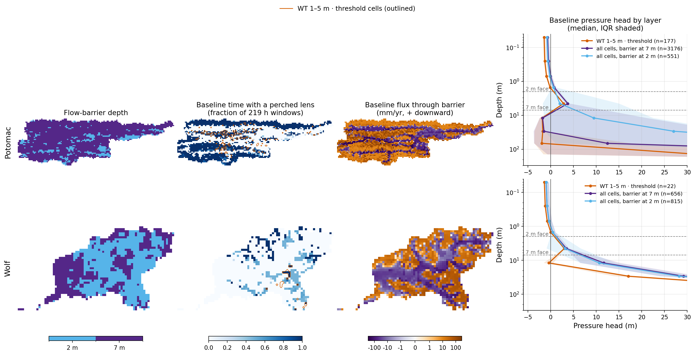
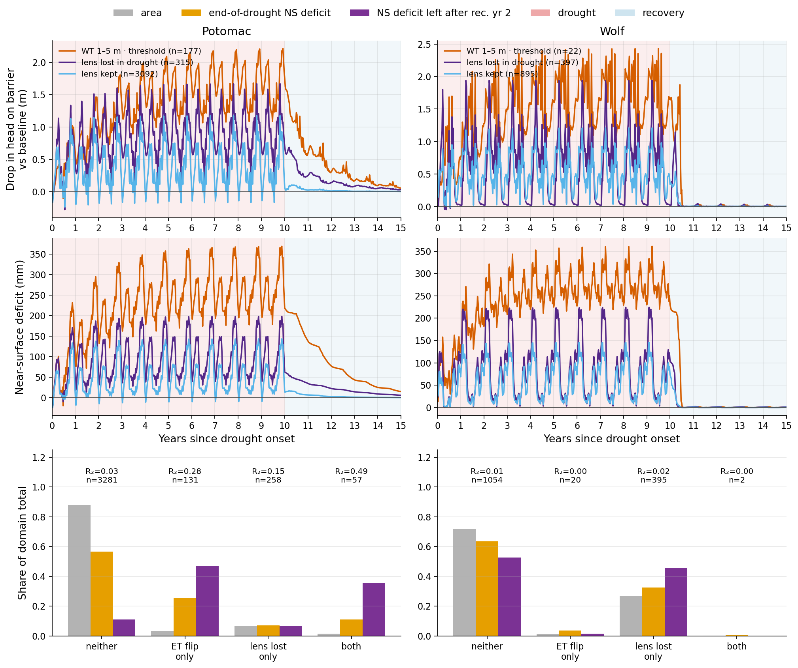
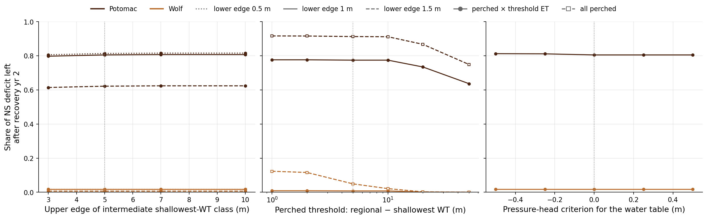

# Potomac perched lens: mechanism and robustness (psa workstream B)

**Script:** `potomac_perched_lens.py` (imports `potomac_sensitivity_attribution`; reads raw 219 h pressure, no new caches)
**Numbers:** `figures/_data/psa_lens.json`
**Figures:** `figures/drought_exploratory/psa_lens_{structure,drought,sensitivity}.png`
**Parent analysis:** [`potomac_sensitivity_attribution_summary.md`](potomac_sensitivity_attribution_summary.md) · [handoff](potomac_sensitivity_attribution_handoff.md)

## Bottom line

1. **The lens is made by the CONUS2 flow barrier, not by the permeability indicator.** Every active cell carries one `FBz = 0.001` barrier: ParFlow multiplies the flux through that cell's *upper* face by 0.001 (`nl_function_eval.c`, `u_upper *= FBz`). The barrier sits on either the z4/z5 face (7 m deep) or the z5/z6 face (2 m deep). All 1,764 Potomac cells with a z5 lens have the barrier at 7 m. All 212 with a lens in z6 have it at 2 m. The indicator K contrast across the 7 m face is only about 2× (median Kz of the lens layer over the layer below). The barrier's contrast is 1000×.
2. **The lens is perched wherever the regional water table lies below the barrier.** No cell with regional WTD < 2 m is perched. 83–92% of cells with regional WTD > 10 m are. That covers 53% of Potomac (almost all uplands) but only 12% of Wolf, where the regional table is usually above the barrier (median 1 m).
3. **The barrier is why these uplands hold water near the surface at all.** In class-4 cells (shallowest WT 1–5 m, ET threshold), baseline leakage through the barrier is about 38 mm/yr, against about 200 mm/yr of net recharge into the top 2 m. Without the 0.001 multiplier the same head gradient would drain about 38,000 mm/yr, and no lens could form. Most of what enters the lens therefore leaves laterally or goes back up to ET. The layer below stays unsaturated (median head −1 m) above a regional table at about 110 m. This is also why H3 fails: the near-surface cannot repay a deep deficit through a barrier that passes a few tens of mm/yr.
4. **The lens thins in drought rather than vanishing, and its water table controls the root zone.** In class-4 cells the head on the barrier falls from 5.3 to 3.6 m (late drought), so the lens water table drops from 1.7 m to 3.4 m, below the 2 m root-zone base. Only 30% of class-4 cells lose the lens outright. Across perched cells, baseline root-zone saturation is 0.97 when the lens table is within 1 m, 0.89 at 1.5–2 m, and 0.53 at 3–4 m. Drought head drop and root-zone drying correlate at ρ = 0.79. The "ET flip" and "lens drawdown" are one coupled process: the lens table sinking below the roots.
5. **Lens loss does not predict R₂ better than the ET flip.** The ET flip alone gives step R² 0.48. Binary lens loss gives 0.12. Continuous head drop gives 0.58, but adds nothing once the ET class is known (partial ρ 0.02). Root-zone drying keeps partial ρ 0.27–0.39 after controlling for lens state. Refilling the lens is a co-symptom of slow root-zone refill: after recovery years 1 / 2 / 5, class-4 cells still miss 26 / 13 / 2% of their end-of-drought head deficit. That tracks the near-surface deficit fractions (0.30 / 0.15 / 0.034).
6. **The class-4 result is robust to every definitional choice tested.** Changing the SWT class edges (lower 0.5–1 m, upper 3–10 m), the perched threshold (1–20 m) or the pressure-head criterion (−0.5 to +0.5 m) keeps the share of the year-2 remainder between 0.78 and 0.82 (Jaccard ≥ 0.98 with class 4 for the head criterion). Only a 1.5 m lower edge (0.62) or a 50 m perched threshold (0.64) moves it much.
7. **Wolf's lenses do not simply stay wet. They thin just as much but refill within a year.** Wolf class-4 heads fall from 5.5 to 3.8 m, about the same as Potomac. 27% of all Wolf cells lose their lens in drought. Yet 0.2% of the class-4 head deficit remains after recovery year 1. Wolf's net recharge into the top 2 m is about 650 mm/yr, against about 200 in Potomac's class-4 cells, so the same lens deficit refills about 3× faster.

## Structure (Q1)



Layers bottom→top: z0 200 m … z4 10 m (7–17 m depth), z5 5 m (2–7 m), z6 1 m (1–2 m), z7–z9 top 1 m. The top four layers (z6–z9) are SSURGO soils s1–s13 with their own van Genuchten parameters. z5 and below are geology g1–g8 / bedrock b1–b2 with the domain default (α = 1 m⁻¹, n = 3) and Kz = 0.1·Kx for most units.

| Potomac, baseline yrs 35–39 | class 4 (n = 177) | all barrier-at-7 m cells (3,176) | barrier at 2 m (551) | streams (112) |
|---|---|---|---|---|
| barrier depth | 7 m (all) | 7 m | 2 m | 7 m (108) |
| time with a perched lens | 0.92 | 0.56 | 0.36 | 0 |
| head on barrier (median) | 5.3 m | 6.3 m | 1.1 m | 7.1 m |
| flux through barrier (median, + down) | 38 mm/yr | 10 mm/yr | 8 mm/yr | −69 mm/yr (upwelling) |
| net recharge into top 2 m (median) | 203 mm/yr | 179 mm/yr | 134 mm/yr | −10 mm/yr |
| Kz lens layer / Kz below (median) | 1.7 | 2.0 | 2.5 | 1.0 |
| regional WTD (median) | 110 m | 55 m | 0.9 m | 0.05 m |

Wolf's barrier is split about evenly (815 cells at 2 m, 656 at 7 m). Its regional table sits above the barrier almost everywhere, so fluxes through the barrier are near zero, and only 22 class-4 cells (regional WTD 12 m) carry a perched z5 lens.

The perched flag in the trait table (regional − shallowest > 5 m) agrees with the physical definition (lens head ≥ 0 on an unsaturated layer, ≥ 50% of windows) for 1,966 of 2,022 Potomac cells. In Wolf they share 118 of about 180.

**Is it physical?** Perched water on a regolith–bedrock contact is a real hillslope process in Valley & Ridge uplands. In this model it comes entirely from a uniform 1000× barrier placed at one of two depths, 2 m or 7 m, which are layer faces rather than mapped contacts. How long Potomac's near-surface memory lasts therefore depends on that parameterization: on the barrier multiplier and on whether the barrier sits at 2 or 7 m. The barrier-depth map is consistent with a depth-to-bedrock product snapped to layer faces, but I did not trace which dataset built `pf_flowbarrier.pfb`.

## Through the 10-yr drought (Q2, Q4)



Top: drop in head on the barrier vs baseline. Middle: near-surface deficit. Bottom: cells split by lens loss (lens present in < 50% of drought years 6–10 windows, having had one ≥ 50% of baseline windows) × ET flip (threshold class).

| Potomac 10-yr | n | area | end-of-drought NS deficit share | year-2 remainder share | R₂ (mass) |
|---|---|---|---|---|---|
| neither | 3,281 | 0.88 | 0.57 | 0.11 | 0.03 |
| ET flip only | 131 | 0.035 | 0.25 | **0.47** | 0.28 |
| lens lost only | 258 | 0.069 | 0.07 | 0.07 | 0.15 |
| both | 57 | 0.015 | 0.11 | **0.35** | **0.49** |

Predicting per-cell R₂ (Potomac non-stream cells with NS deficit > 10 mm, n = 1,519):

| Predictor | ρ | step R² | partial ρ |
|---|---|---|---|
| log baseline overland flow | −0.43 | 0.71 | |
| baseline GS root-zone saturation | −0.42 | 0.66 | |
| drought head drop on barrier | 0.31 | 0.58 | 0.02 given ET class |
| ET flip (threshold class) | 0.20 | 0.48 | |
| drop in lens-present fraction | 0.12 | 0.41 | |
| root-zone saturation drop | 0.39 | 0.36 | 0.39 given lens lost · 0.27 given head-drop tercile |
| lens lost (binary) | 0.05 | 0.12 | |

In Wolf every predictor has step R² < 0.1, as in the parent analysis.

## Sensitivity (Q3)



Share of the Potomac year-2 near-surface remainder in the key class:

| Variant | n | remainder share | R₂ (mass) |
|---|---|---|---|
| class 4 as defined (SWT 1–5 m, head ≥ 0, threshold ET) | 177 | 0.81 | 0.36 |
| SWT lower edge 0.5 m (any upper edge 3–10 m) | 182–185 | 0.81–0.82 | 0.34 |
| SWT lower edge 1.5 m | 121–124 | 0.61–0.62 | 0.41 |
| head criterion −0.5 … +0.5 m | 177–181 | 0.81 | 0.35 |
| perched (gap > 1–10 m) × threshold ET | 173–174 | 0.78 | 0.35 |
| perched (gap > 50 m) × threshold ET | 139 | 0.64 | 0.37 |
| all perched, gap > 5 m (no ET condition) | 2,022 | 0.91 | 0.21 |
| physically perched on the barrier (no WT threshold) | 1,976 | 0.91 | 0.21 |
| SWT 1–5 m × baseline root-zone sat < 0.90 (no drought info) | 145 | 0.54 | 0.47 |

All but three threshold-ET cells with SWT ≥ 1 m already sit below 3 m, so the upper edge is irrelevant. Being perched on the barrier is close to necessary (91% of the remainder in 53% of the area). The ET threshold picks out the slowest tenth of the perched cells. The baseline-only proxy overlaps class 4 by only 42% (Jaccard) and captures 54% of the remainder, so it is a partial substitute, not an equivalent (workstream C).

## Caveats

- Pressure is the end-of-window snapshot (219 h), so the flux through the barrier and into the lens is a snapshot estimate. It is fine for the slow barrier face; the 2 m face flux is noisier. Net recharge uses the window-mean ParFlow source.
- "Head on barrier" = lens-layer pressure + half its thickness (hydrostatic within the layer). It exceeds the layer thickness where the lens is connected to shallower saturation.
- The domains `potomac_flow_barrier_*` have the same `pf_flowbarrier.pfb` as potomac2 and only 2 spinup years. I did not check what they vary. If they change the barrier multiplier, a drought pair on one of them would test result 3 directly.

## Reproduce

```bash
conda activate /glade/work/bwest/conda-envs/droughts
cd /glade/derecho/scratch/bwest/drought-ensemble
python analysis/potomac_perched_lens.py   # ~1 min on a login node; needs psa caches + cell_traits_*.nc
```
