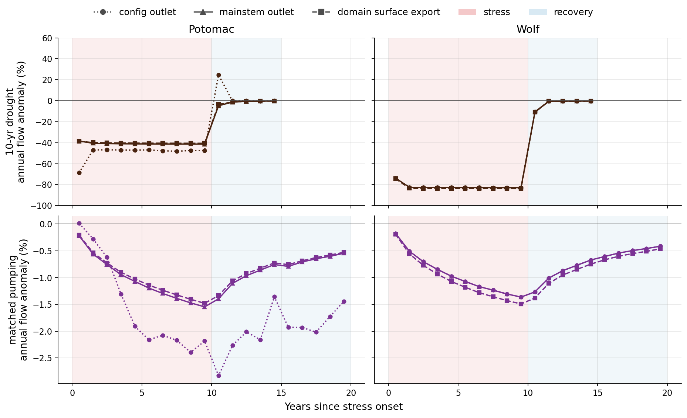
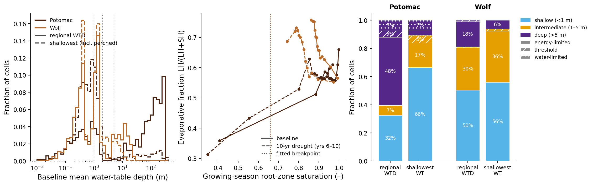
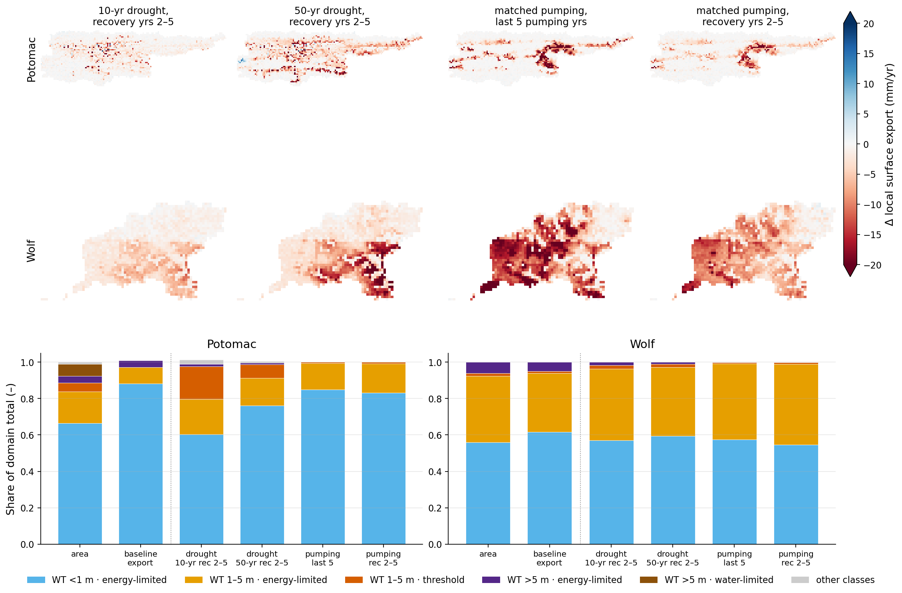
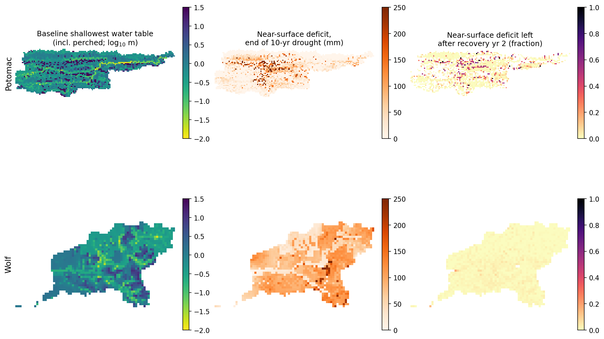
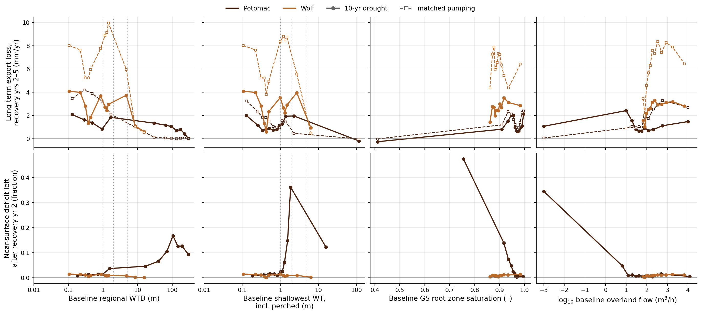
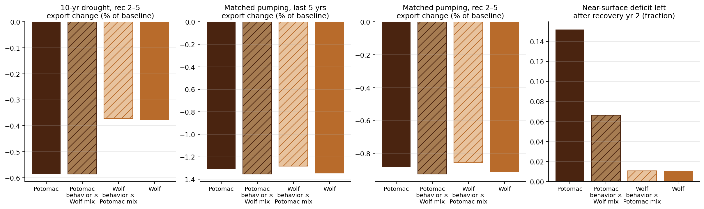
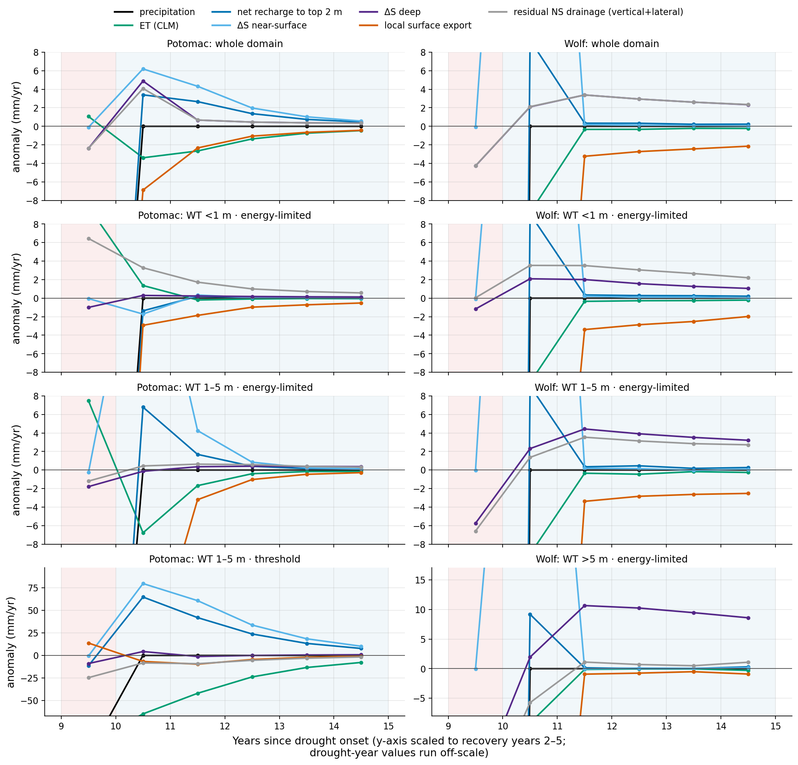
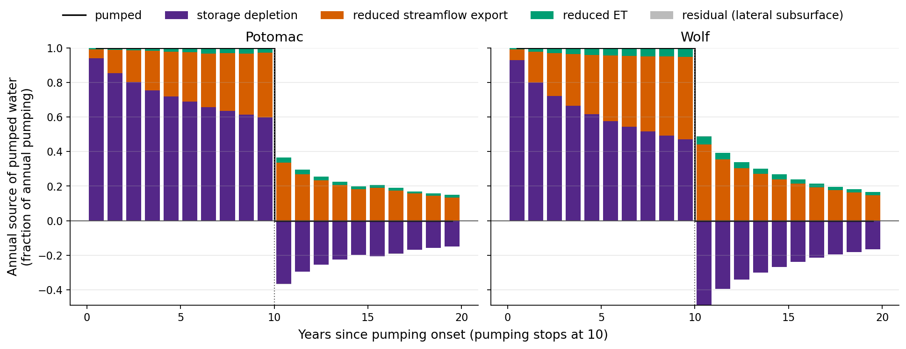

# Why Potomac streamflow and near-surface storage look more drought- and pumping-sensitive

**Script:** `potomac_sensitivity_attribution.py` (reads slim caches written by `psa_extract.py` / `psa_extract.pbs`)
**Numbers:** `figures/_data/psa_summary.json` · per-cell traits `figures/_data/cell_traits_{potomac2,wolf2}.nc`
**Figures:** `figures/drought_exploratory/psa_*.png`
**Runs:** `droughts/{short_baseline, baseline, 10_year_drought, 50_year_drought}`, matched pumping `10_year_pumping_tests/pumping_8.64e-7` (Potomac) and `pumping_2.49e-6` (Wolf).
**Continuing this work:** [`potomac_sensitivity_attribution_handoff.md`](potomac_sensitivity_attribution_handoff.md) (code map, gotchas, parallel workstreams).
**Perched-lens mechanism (workstream B):** [`potomac_perched_lens_summary.md`](potomac_perched_lens_summary.md). The lens sits on the CONUS2 flow barrier at 7 m, and the class-4 result is robust to the definitional choices.

## Bottom line

1. **Pumping: Potomac is not more sensitive.** At the mainstem outlet, matched pumping costs 1.38% (Potomac) vs 1.23% (Wolf) of flow in the last 5 pumping years and 0.92% vs 0.83% in recovery years 2–5. About 9% of the pumped volume comes out of streamflow in recovery years 2–5 in both domains. The larger Potomac response in `comparison/compare_drought_pump_recovery_flow_anomaly.png` comes from **sampling the config outlet (66, 135), a nearly dry cell** (0.1 mm/yr vs 180 mm/yr at the mainstem), with sparse pressure snapshots (draft stride 4). Stride-4 snapshots at that cell give −7.4 / −6.2 / −4.6% in pumping recovery years 1 / 2 / 5. Its window mean gives −2.8 / −2.3 / −1.4%, and window-mean flow at the mainstem gives −1.4 / −1.1 / −0.8%. Both the cell choice and the snapshot sampling inflate the number. That figure has since been regenerated at the mainstem (see "Implications for existing figures").
2. **Drought: Potomac's long-term streamflow residual is about 2× Wolf's as a percentage of flow, but smaller in mm/yr.** In recovery years 2–5 it is −0.61% (−1.1 mm/yr) vs −0.35% (−2.0 mm/yr) after 10 years, and −1.50% vs −0.70% after 50. Potomac's baseline flow is about a third of Wolf's, so the percentage view makes the difference look bigger.
3. **The semi-persistent near-surface loss is real and belongs to Potomac alone.** 15% of Potomac's end-of-drought near-surface deficit remains after 2 recovery years, against 1% for Wolf. It is concentrated in **a small class of upland cells with a perched water table about 1–2 m down, above a regional water table about 110 m deep, and no overland connectivity.** These cells are 4.7% of the domain. In drought the perched table falls from about 1.7 m to 7.5 m and the root zone switches from energy-limited to water-limited ET. They hold 35% of the near-surface deficit at drought end and 80% of what remains after recovery year 2.
4. **Your hypothesis, revised:** the vulnerable cells *are* intermediate-water-table cells at the edge of water limitation. But the relevant water table is the **perched** one, not the regional WTD, and Potomac does not have *more* of them. It has fewer intermediate cells than Wolf (23% vs 38% by shallowest water table). Potomac's intermediate cells **behave** differently: they are perched, disconnected, and in a drier climate (φ ≈ 0.93 vs 0.62). Class-composition swaps explain **none** of the drought streamflow-residual gap. For the near-surface-persistence gap, giving Potomac's cells Wolf's class mix removes about 60% of it, but giving Wolf's cells Potomac's mix adds none. Composition only matters in combination with Potomac's behavior.

## How this was measured (read before the numbers)

- **Flow = 219 h window means.** The analysis first used outflow recomputed from end-of-window pressure snapshots. Because the same forcing year repeats, snapshots hit the same storm hours every year. At flashy upland cells that aliases the snapshot mean by up to 10× (Wolf (55, 18): 622 vs 66 m³/h). All results here use the stored window-mean `overland_flow` (every analysed file is tagged `mean over each 219-hour window`).
- **Local surface export (per-cell "contribution").** `overland_bc_flux` is all zeros in the 219 h files. Instead, each cell's net surface outflow divergence is computed as outflow minus inflow from its upstream neighbours. Under OverlandKinematic upwinding the face partition of each cell's outflow depends only on slope and Manning's n, so window-mean face fluxes follow exactly from the window-mean outflow grid. On snapshots this reproduces the ParFlow face-flux divergence to float32 precision. Summed over the domain it equals total boundary outflow ("domain export"). That is 191 vs 180 mm/yr at the mainstem for Potomac, and 699 vs 574 for Wolf (Wolf also drains across other edges).
- **Mainstem outlet** = cell with the largest baseline flow: Potomac (63, 129), matching the USGS-validation snap; Wolf (18, 21), the config outlet.
- **Water-table classes.** *Regional WTD* is the stored `wtd` (measured up from the bottom). *Shallowest WT* is the depth to the uppermost layer with pressure head ≥ 0, which counts perched lenses. The Potomac uplands have a saturated lens in layer z5 (2–7 m) sitting on an unsaturated interval above a regional table about 100–150 m down. The regional WTD cannot see it.
- **ET regime.** The model's vegetation stress is linear in root-zone saturation (`WiltingPoint` 0.2, `FieldCapacity` 1.0, `RootZoneNZ` 4, which is the top 2 m). The growing-season evaporative fraction LH/(LH+SH) was fitted with a pooled breakpoint regression on root-zone saturation: critical saturation s_c = 0.66, R² 0.15. Wolf alone never leaves the plateau. Classes: *energy-limited* stays above s_c in baseline and in drought years 6–10; *threshold* is above s_c in baseline and below it in drought; *water-limited* is below s_c in baseline.
- **Near-surface / deep** = layers z≥6 (top 2 m) / z<6, as in `shallow_deep_shielding.py`. "Remaining fraction" R_k is the near-surface deficit at the end of recovery year k divided by the deficit at the end of the drought.
- CLM hourly output was aggregated to the same 219 h windows (`psa_extract.read_clm_219h`). The CLM files interleave variables per timestep, so the reader indexes chunk offsets and reads each file once in offset order, about 2× faster than per-variable reads.

## Step 0 — Normalization (H0)

Mainstem outlet, window means. "Deficit" is the end-of-stress total storage deficit; the cumulative flow loss over the period is divided by it.

| Case, period | Potomac ΔQ mm/yr | % of Q | % of P | cum. / deficit | Wolf ΔQ mm/yr | % of Q | % of P | cum. / deficit |
|---|---|---|---|---|---|---|---|---|
| 10-yr drought, last 5 dry yrs | −74.3 | −41.3 | −9.4 | — | −476 | −82.9 | −31.1 | — |
| 10-yr drought, rec yr 1 | −8.6 | −4.8 | −1.1 | 0.19 | −60.7 | −10.6 | −4.0 | 0.44 |
| 10-yr drought, rec yrs 2–5 | −1.10 | −0.61 | −0.14 | 0.10 | −1.99 | −0.35 | −0.13 | 0.06 |
| 50-yr drought, rec yrs 2–5 | −2.69 | −1.50 | −0.34 | 0.09 | −4.02 | −0.70 | −0.26 | 0.07 |
| matched pumping, last 5 yrs | −2.48 | −1.38 | −0.31 | 0.16 of pumped | −7.06 | −1.23 | −0.46 | 0.16 of pumped |
| matched pumping, rec yrs 2–5 | −1.66 | −0.92 | −0.21 | 0.09 of pumped | −4.77 | −0.83 | −0.31 | 0.09 of pumped |
| matched pumping, rec yrs 6–10 | −1.18 | −0.66 | −0.15 | 0.08 of pumped | −2.89 | −0.50 | −0.19 | 0.07 of pumped |

Baselines: P = 792 / 1532 mm/yr and mainstem Q = 180 / 574 mm/yr for Potomac / Wolf. The storage deficits are 167 / 204 Mm³ (10-yr), 463 / 349 Mm³ (50-yr), and 205 / 203 Mm³ (pumping, with 282 / 321 Mm³ pumped).

Forcing contrast: the Potomac dry year is only about 10% drier (−79 mm/yr), and nearly all of that comes out of export (−78 mm/yr, ΔET +1). Wolf's dry year is 42% drier (−649 mm/yr), with export −586 and ET −58. Potomac's larger percentage drop in flow for a milder drought (streamflow elasticity about 4 vs 2) is the Budyko expectation for a basin with φ ≈ 0.9 and Q/P ≈ 0.23.



**Verdict H0 — largely confirmed.** For pumping, the Potomac excess disappears at the mainstem (+10% relative, the same share of pumped water). It was an artifact of the config outlet plus snapshot sampling. For drought, Potomac's residual is about 2× larger in percentage, about the same as a fraction of P, only moderately larger per unit storage deficit (0.10 vs 0.06), and smaller in mm/yr. The remaining real contrast is the near-surface persistence (Step 3), plus a modestly larger drought residual per unit deficit.

## Step 1 — Trait table



| | Potomac | Wolf |
|---|---|---|
| Regional WTD <1 / 1–5 / >5 m | 32 / 7 / 60% | 50 / 31 / 19% |
| Shallowest WT (incl. perched) <1 / 1–5 / >5 m | 67 / 23 / 10% | 56 / 38 / 6% |
| Cells whose seasonal WTD range crosses 2 m | 5.7% | 31.6% |
| ET class energy-limited / threshold / water-limited | 87.6 / 5.0 / 7.4% | 98.5 / 1.5 / 0% |
| Cell φ (Hamon PET / P) | ≈ 0.9 | ≈ 0.62 |

Traits of the key class (shallowest WT 1–5 m, threshold) at baseline year 39:

| | Potomac (n = 177, 4.7%) | Wolf (n = 22, 1.5%) |
|---|---|---|
| Shallowest WT baseline → drought (median) | 1.7 m → 7.5 m | 1.5 m → 3.6 m |
| Regional WTD (median) | 110 m | 12 m |
| Perched (regional − shallowest > 5 m) | 92% | 59% |
| Root-zone saturation, growing season, baseline → drought | 0.86 → 0.51 | 0.86 → 0.56 |
| log₁₀ baseline overland flow (m³/h, median) | −3 (none) | 1.8 |

## Step 2 — Where the long-term streamflow loss comes from



Share of the domain Δ export by class (shallowest WT × ET regime), compared with each class's share of area and of baseline export:

| Class | Potomac area / base export | Potomac 10-yr rec 2–5 | Potomac 50-yr rec 2–5 | Potomac pump rec 2–5 | Wolf area / base export | Wolf 10-yr rec 2–5 | Wolf pump rec 2–5 |
|---|---|---|---|---|---|---|---|
| WT <1 m · energy | 0.67 / 0.88 | 0.60 | 0.76 | 0.83 | 0.56 / 0.62 | 0.57 | 0.55 |
| WT 1–5 m · energy | 0.17 / 0.09 | 0.19 | 0.15 | 0.16 | 0.36 / 0.32 | 0.39 | 0.44 |
| WT 1–5 m · threshold | 0.047 / ≈0 | **0.18** | 0.08 | 0.01 | 0.015 / 0.01 | 0.02 | 0.01 |

After drought, Potomac's perched threshold cells supply essentially no baseline export but account for 18% of the 10-yr long-term loss (8% after 50 years). They act as sinks for run-on from upslope while their root zones refill. Pumping losses sit in the valley-bottom WT <1 m cells in Potomac (83%) and are split between shallow and intermediate cells in Wolf. In both domains that is baseflow capture near streams.

## Step 3 — Near-surface persistence



| Fraction of the end-of-drought near-surface deficit remaining | rec yr 1 | rec yr 2 | rec yr 5 |
|---|---|---|---|
| Potomac, 10-yr | 0.30 | 0.15 | 0.034 |
| Potomac, 50-yr | 0.30 | 0.16 | 0.042 |
| Wolf, 10-yr | 0.013 | 0.011 | 0.009 |
| Wolf, 50-yr | 0.021 | 0.019 | 0.015 |

Potomac by class (10-yr): WT 1–5 m · threshold holds 34.5% of the end deficit and 80.5% of what remains after recovery year 2 (mass-weighted R₂ = 0.36). WT <1 m cells hold 35% of the end deficit but only 5% of the year-2 remainder (R₂ = 0.02).

Within-drought regeneration (the share of wet windows in which the near-surface deficit returns to within 10% of baseline) is 0.87 for Potomac WT <1 m cells vs 0.47 for WT 1–5 m. Wolf shows a similar gradient (0.72 vs 0.41), yet Wolf's intermediate cells still recover within a year.

## Step 4 — Hypothesis tests

Predictive skill for the Potomac near-surface remaining fraction R₂ uses non-stream cells with a deficit above 10 mm (Spearman ρ, best single step R², 12-bin R²):

| Predictor | ρ | step R² | bin R² |
|---|---|---|---|
| log baseline overland flow | −0.43 | **0.71** | 0.64 |
| baseline root-zone saturation (step at 0.90) | −0.42 | **0.66** | 0.68 |
| drought drop in shallowest WT | 0.24 | 0.39 | 0.43 |
| log shallowest WT | 0.22 | 0.28 | 0.40 |
| end-of-drought deep deficit | 0.30 | 0.19 | 0.22 |
| log regional WTD | 0.16 | 0.09 | 0.11 |

In Wolf every predictor has step R² < 0.1, because there is almost no persistence to explain.

Per-cell skill for the long-term export loss is low for Potomac drought (every step R² < 0.05), so that attribution is only meaningful as class sums (Step 2). Per-cell pumping loss is better predicted, by proximity of the regional water table: in Potomac, log WTD and the fraction of time WTD is under 2 m each give step R² of about 0.30. Wolf's drought loss per cell tracks its own deep deficit (step R² 0.28).



**H1 — intermediate water table.**
- **Rejected as stated** (regional WTD). Potomac has fewer 1–5 m cells (7% vs 31%) and fewer cells whose water table swings across 2 m (6% vs 32%). Regional WTD barely predicts persistence (R² 0.09).
- **Supported when the perched table is used.** Potomac's persistence peaks sharply for cells whose shallowest water table sits at about 1.5–2 m, just below the root zone (psa_hypothesis_bins, lower row, second column). Cells with WT 1–5 m hold 59% of the end deficit and 90% of the year-2 remainder. They are still not more common in Potomac (23% vs 38%). They matter because they behave differently, not because there are more of them.

**H2 — water/energy threshold.**
- **Supported for near-surface persistence.** The threshold class is rare in Potomac (5%), but it is exactly where the persistent deficit sits: 36% of the end deficit, 82% of the year-2 remainder, mass-weighted R₂ 0.34 against 0.03 for energy-limited cells.
- The class definition uses the drought response, which is partly circular. The baseline-only proxy avoids that: baseline root-zone saturation below 0.90 alone gives step R² 0.66.
- **Partially supported for streamflow.** These cells carry 18% of the 10-yr long-term export loss with about 0% of baseline export.

**H3 — near-surface refilled from above to repay the deep deficit.** **Rejected for Potomac.** The raw correlation between R₂ and the deep deficit below (ρ = 0.30) collapses to 0.09 once the WT × ET class is controlled. In the threshold cells, water leaving the top 2 m other than as export drops during recovery (about −10 mm/yr) and ΔS deep stays near 0 (Step 6). The near-surface is holding water, not passing it downward. In Wolf the partial ρ is 0.45, but Wolf's near-surface persistence is negligible.

**Interactions.** Overland participation is the gate. Among Potomac cells with deep regional WTD, the lowest overland-flow tercile has mass-weighted R₂ = 0.25, against 0.02 for the other terciles. 184 of the 188 threshold cells fall in the lowest overland-flow tercile.

## Step 5 — Composition vs behavior

Classes are shallowest WT × ET regime. "Behavior" means per-class mean responses; "mix" means class area fractions.



| Response | Potomac | Potomac behavior × Wolf mix | Wolf behavior × Potomac mix | Wolf |
|---|---|---|---|---|
| 10-yr drought, rec 2–5 export change (% of baseline) | −0.585 | −0.586 | −0.372 | −0.377 |
| Pumping, last 5 yrs (%) | −1.31 | −1.35 | −1.28 | −1.35 |
| Pumping, rec 2–5 (%) | −0.88 | −0.92 | −0.85 | −0.91 |
| Near-surface R₂ | 0.152 | 0.066 | 0.011 | 0.011 |

The drought streamflow residual gap is **all behavior**. Swapping mixes changes nothing.

The near-surface persistence gap is a **behavior × composition interaction**. Potomac's cells under Wolf's mix lose about 60% of the gap, because Wolf has fewer threshold cells. Wolf's cells under Potomac's mix gain nothing, because Wolf's threshold and intermediate cells refill within a year (class R₂ ≤ 0.001). Wolf's behavior covers 92% of Potomac's area; the missing classes are ones Wolf does not have.

Grouping by regional WTD × ET gives the same conclusion for drought (`step5_decomposition_wtd` in the JSON). Its pumping bars are unstable because the regional-WTD classes put Potomac's valley cells and perched uplands in different bins from Wolf's.

## Step 6 — Mechanism: class column budgets

Anomalies relative to baseline, in mm/yr. "Residual NS drainage" is recharge − ΔS_ns − export, i.e. vertical plus lateral outflow from the top 2 m.



Whole-domain means over recovery years 2–5 after the 10-yr drought:

| | ET | ΔS near-surface | ΔS deep | export |
|---|---|---|---|---|
| Potomac | −1.31 | **+1.97** | +0.46 | −1.12 |
| Wolf | −0.28 | +0.10 | **+2.81** | −2.64 |

- **Potomac's long-term streamflow deficit goes into refilling the near-surface**, and suppressed ET pays part of it. **Wolf's goes into refilling deep storage** beneath shallow and intermediate cells.
- **Potomac perched threshold cells.** During the drought, ET absorbs the loss (−100 mm/yr by the last dry year). Export actually rises (+14 mm/yr) because these baseline run-on sinks absorb less. In recovery, ET stays suppressed (about −65, −42, −23, −13, −8 mm/yr over recovery years 1–5). The near-surface refills only from the local infiltration surplus (+80, +60, +33, +18, +10 mm/yr), since there is no groundwater support from below and no run-on. That slow refill is the multi-year near-surface recovery.
- **Potomac WT <1 m cells** show a small export deficit (−1.9 → −0.5 mm/yr) matched by extra drainage to the deep zone, the same pattern Wolf shows over much more area.

## Step 7 — Pumping source partition



| Share of pumped water | storage | streamflow export | ET | residual |
|---|---|---|---|---|
| Potomac, 10 pumping years | 0.73 | 0.25 | 0.02 | 0.00 |
| Potomac, pumping years 6–10 | 0.64 | 0.33 | 0.03 | 0.00 |
| Wolf, 10 pumping years | 0.63 | 0.33 | 0.04 | 0.00 |
| Wolf, pumping years 6–10 | 0.52 | 0.43 | 0.05 | 0.00 |

The pumping flux appears exactly in the deep-layer `evaptrans` anomaly (ratio −1.00), and the budget closes. **The prediction that Potomac pumping is paid mostly by lost streamflow from intermediate or threshold cells is rejected.** Wolf switches to streamflow capture faster. In Potomac, the lost export comes from valley-bottom cells with WT <1 m (83–85%); perched threshold cells contribute under 1%. Near-surface storage barely participates in either domain (under 1.5% of pumped water).

## Caveats

- **Baseline remaps.** Potomac `baseline` years ≥ 55 are not condensed, so the 50-yr recovery and pumping recovery years 5–9 use `short_baseline` years 50–54. Storage differences stay on the remapped track (`base_prev_end`), so annual ΔS is continuous. Wolf 50-yr late-drought years use `baseline` 90–94.
- **ET breakpoint is weak** (pooled R² 0.15). The ET classes lean more on the root-zone drop than on a sharp physical threshold. The baseline-only saturation predictor gives the same answer.
- **Per-cell export changes are noisy**, because routing redistributes flow along channels. Class sums are robust; per-cell skill is not.
- **One wetness year repeats.** Recovery in recovery year 1 is sensitive to the fixed storm calendar.

## Implications for existing figures

**Fixed 22 Sep 2026 (handoff workstream A).** The deck figures had used the near-dry config cell and sparse snapshots. For Potomac, those percentages did not describe basin streamflow. Snapshot sampling also inflated Wolf's pumping anomaly (−2.8% vs −1.3% in recovery year 1).

All outlet series now go through `analysis/outlet_flow.py`: the Potomac mainstem at (63, 129), true window means, and block-averaging in draft. Regenerated with it:
- `comparison/compare_drought_pump_recovery_flow_anomaly.png`
- `drought_final/story_recovery_flow_anomaly_combined.png`
- `drought_final/ten_year_drought_streamflow_storage.png`
- `pumping_final/ten_year_pumping_recovery_flow_anomaly.png`
- `pumping_final/ten_year_pumping_streamflow_storage{,_by_rate}.png`
- the exploratory `story_*flow_anomaly`, `fifty_year_drought_streamflow_storage` and `drought_recovery_totals_and_anomalies` figures

The file audit behind the fix found that catalog `10_year_pumping_tests` years 43–49 store end-of-window snapshots even though their `overland_flow` is tagged as a window mean.

## Manuscript figures (draft captions)

Builder: `make_psa_paper_figures.py` (run after `potomac_sensitivity_attribution.py`). Output: `figures/psa_final/`.

**Narrative, in three steps:**
1. Potomac does not lose more flow to pumping than Wolf does, once flow is measured at the basin mainstem.
2. Potomac's drought residual is larger only as a percentage of its smaller flow.
3. The one real Potomac-only signal is slow near-surface recovery, confined to perched upland cells whose ET is suppressed while they refill.

**Figure A — `psa_paper_flow_normalization.png`.**
- Columns are domains (Potomac | Wolf). Stress colors are shared across rows: sequential browns for 10- and 50-yr drought, purple for pumping matched to the 10-yr drought.
- (a, b) Mainstem window-mean annual flow anomaly in recovery. Drought recovery is only 5 years long in the current runs; pumping continues through year 10.
- (c, d) Mean mainstem flow change in recovery years 2–5 (% of baseline; mm/yr in parentheses).
- (e, f) End-of-stress column storage deficit partitioned into temporary (recovered in recovery year 1) and persistent (remaining after year 1), for the 10-yr drought and pumping matched to it.

**Figure B — `psa_paper_perched_maps.png`.**
- Baseline (a, d) regional water-table depth and (b, e) depth to the shallowest saturated layer, which includes perched lenses.
- (c, f) Near-surface (top 2 m) storage deficit remaining at the end of recovery year 2 after the 10-year drought.
- Outlined cells have a shallowest water table of 1–5 m and cross the ET threshold (root-zone saturation s_c = 0.66) during drought. They are 4.7% of Potomac and hold 80% of its year-2 near-surface deficit; in Wolf they are 1.5% of the area and hold 2%.

**Figure C — `psa_paper_recovery_budgets.png`.**
- Annual column-budget anomalies after the 10-year drought, relative to baseline (mm/yr, class mean), for (a) Potomac perched-threshold cells and (b) Wolf cells with a shallowest water table of 1–5 m and energy-limited ET.
- (c) Whole-domain mean anomalies over recovery years 2–5.
- "Lateral subsurface outflow" is the budget residual (ΔP − ΔET − Δexport − ΔS). Potomac repays its long-term deficit into the near-surface while ET stays suppressed; Wolf repays it into deep storage.

## Reproduce

```bash
conda activate /glade/work/bwest/conda-envs/droughts
cd /glade/derecho/scratch/bwest/drought-ensemble
qsub -q casper@casper-pbs analysis/psa_extract.pbs      # ~140 year-files, 16 workers, resume-safe
python analysis/psa_extract.py --flowmean --workers 8    # window-mean flow + local gain caches
python analysis/potomac_sensitivity_attribution.py       # figures + JSON
```

Caches: `figures/_cache/psa/<domain>/<hash>.nc` (slim 219 h fields + CLM window means), `<hash>_qwm.nc` (window-mean flow and gain), `forcing_<domain>_<wetness>.npz`.
